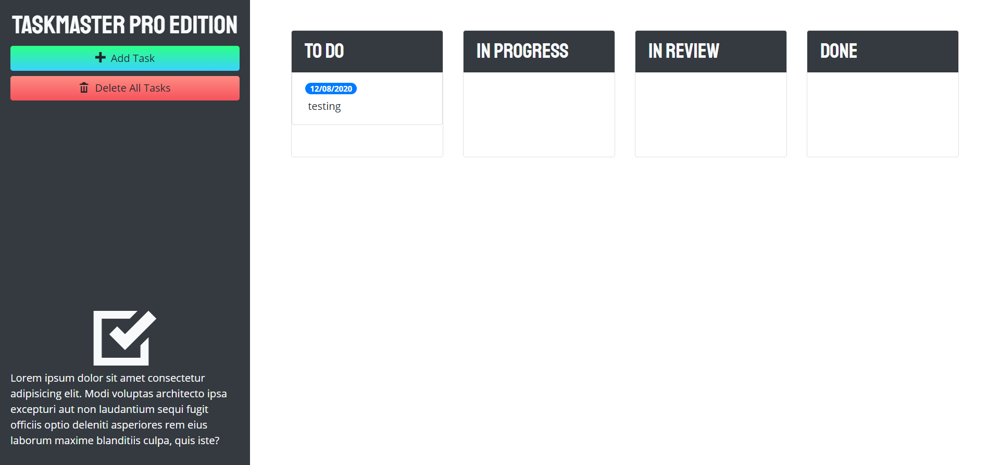
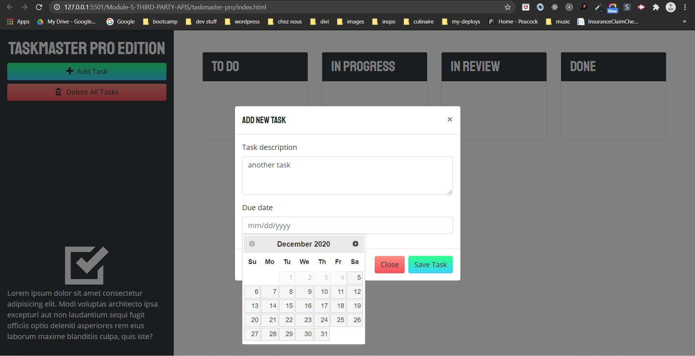
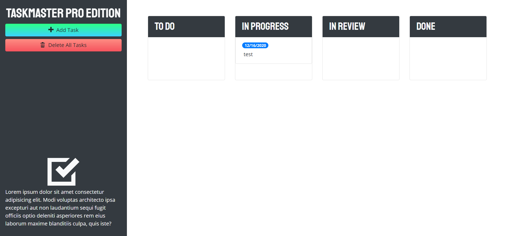

# taskmaster-pro

## Description
A productivity application to track tasks with a user-friendly Kanban style drag and drop interface. 

##### Task Todo

##### Task Input Form

##### In Progress View

Visit site [here](https://christopherconcannon.github.io/taskmaster-pro/)

## Table of Contents
  * [Installation](#installation)
  * [Usage](#usage)
  * [License](#license)
  * [Technologies](#technologies)
  * [Contributing](#contributing)
  * [Testing](#testing)
  * [Questions](#questions)
  
## Installation
Clone project to a directory on your local machine and cd into taskmaster-pro directory.  

## Usage
Open index.html file in browser of your choice.  Click on button to 'Add a Task', then enter task into the modal form that appears.  Select a date with the date picker and 'Save Task'.  Your new task will appear in the 'To Do' column.  Drag your task to the various columns as it reaches it's various levels of completion.  To delete a task, simply drag it to the area that appears at the bottom of the screen when the task is dragged.  Enter as many tasks as necessary. 

## License 
This project is covered under the MIT license 

## Technologies 
HTML5, CSS3, Bootstrap, JavaScript, jQuery

## Contributing
To see the guidelines adopted for contributing to this project, please view the [Contributor Covenant](https://www.contributor-covenant.org/version/2/0/code_of_conduct/code_of_conduct.txt)

## Testing
Tests coming soon

## Questions
Visit me at GitHub  
[christopherConcannon](https://github.com/christopherConcannon)
  
If you have any questions or would like to contact me, please email me at  
[cmcon@yahoo.com](mailto:cmcon@yahoo.com)
